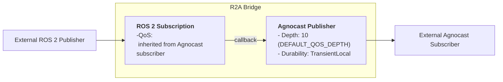
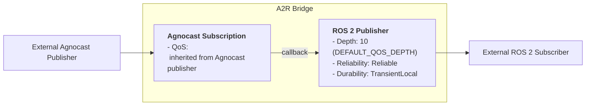

# Bridge Internal Design

This document covers internal design notes for the Agnocast-ROS 2 Bridge. For user-facing documentation (bridge modes, configuration, plugins, QoS behavior), see [Agnocast-ROS 2 Bridge](https://autowarefoundation.github.io/agnocast_doc/migration-guide/bridge/) on the documentation site.

## Isolation & Safety

Because a single bridge manager process is shared across all Agnocast processes in the IPC namespace, a crash in the bridge manager will affect all bridged topics.

## Internal Structure

Each bridge direction creates a pair of internal publisher and subscriber.
The internal publisher's QoS is fixed to maximize compatibility, ensuring connectivity regardless of the external QoS settings.

**R2A Bridge (RosToAgnocastBridge)**:

**A2R Bridge (AgnocastToRosBridge)**:

